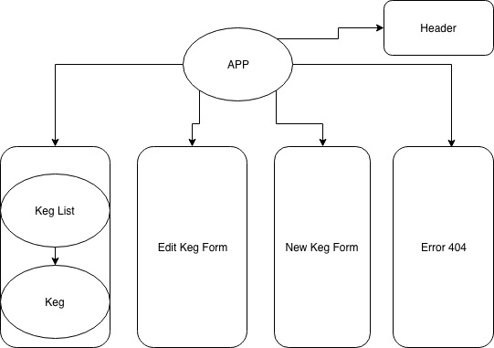

# Tap Room

## Angular to React Refactor

#### Epicodus React independent project, 09.07.18

#### By Scott Fraser

## Description

A React App that is a refactor of an Angular excersice in building out CRUD and structuring components.

## Setup on OSX

- Clone the repo
- `yarn` installs dependencies
- `yarn start` starts the development server on localhost:3000
- `yarn build` bundles the app into static files for production
- `yarn test` starts the test runner

## Route Path

## Contribution Requirements

1. Clone the repo
1. Make a new branch
1. Commit and push your changes
1. Create a PR

## Technologies Used

- Node.js
- JavaScript
- React
- Babel
- Webpack
- Yarn

## License

This software is licensed under the MIT license.

Copyright (c) 2018 **Scott Fraser**
